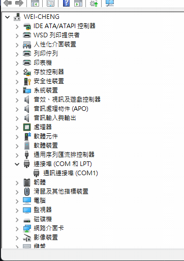

成大工科 工程科學暨創新概論 ESP32

## 1. 相關資源

-   [Arduino SpeedUp 系列課程指南 - LazyTomato Lab](https://www.lazytomatolab.com/guide/)

## 2. 開發版

-   ESP32-S3 開發板 N16R8：[[RWG] ESP32-S3 開發板 N8R2/N16R8 | 蝦皮購物](https://shopee.tw/-RWG-ESP32-S3-%E9%96%8B%E7%99%BC%E6%9D%BF-N8R2-N16R8-i.14363185.22789519649?sp_atk=cfea3333-fd64-41e0-bf09-ddbae1f48bac&xptdk=cfea3333-fd64-41e0-bf09-ddbae1f48bac)
-   [WEMOS D1 LOLIN32 V1.0.0 ESP-32 基於 WIFI 和藍牙 4MB 記憶體 外接 PH2.0 電源插頭 – 台灣物聯科技 TaiwanIOT Studio](https://www.taiwaniot.com.tw/product/wemos-d1-lolin32-v1-0-0-esp-32-%e5%9f%ba%e6%96%bcwifi%e5%92%8c%e8%97%8d%e7%89%994mb-%e8%a8%98%e6%86%b6%e9%ab%94/)

## 3. 常見開發版

-   如果使要使用 ESP 相關的開發版，你在網路上一定會看到這些
-   ESP32
-   ESP8266
-   D1 mini
-   LOLIN D32
-   ESP32-S3

### 3.1. 軟體介面：arduino IDE

-   安裝教學：[Arduino 教學-下載與安裝 Arduino IDE，開始撰寫你的第一隻 Arduino | 梅問題．教學網](https://www.minwt.com/arduino/22305.html)
-   調整縮排：https://blog.csdn.net/m0_53401243/article/details/128140112

### 3.2. USB 線插入

## 4. 基礎測試

### 4.1. [Lab：序列埠 (Serial Monitor) 訊息輸出 01](./Lab/Test_Serial_Monitor01/Test_Serial_Monitor.ino)

### 4.2. [Lab：序列埠 (Serial Monitor) 訊息輸出，輸入 EXIT 離開](./Lab/Test_Serial_Monitor02/Test_Serial_Monitor02.ino)

### 4.3. [Lab：取得開發版晶片編號](./Lab/GetChipID_ESP32/GetChipID_ESP32.ino)

## 5. GPIO

### 5.1. LED（Light-Emitting Diode，發光二極體）

-   是一種能夠發光的半導體電子元件
-   1962 年首次出現，早期僅能發出紅光，後來發展出其他顏色的版本。
-   特性：
    -   單向導通（順向偏壓）：只有一個方向可導通（通電）。
    -   電致發光效應：當電流通過時，電子與電洞重合而發出單色光。
    -   採用不同的半導體材料調整波長，影響 LED 發出的光顏色。
    -   高效率、壽命長、不易破損、反應速度快、可靠性高。

### 5.2. [Lab：控制 LED 發光](./Lab/Test_LED/Test_LED.ino)

### 5.3. [Lab：列出當下所有熱點](./Lab/WiFiScan_ESP32/WiFiScan_ESP32.ino)

### 5.4. [Lab：列出當下所有熱點，輸入帳密連線](./Lab/WiFiScan_ESP32/WiFiScan_ESP32.ino)
